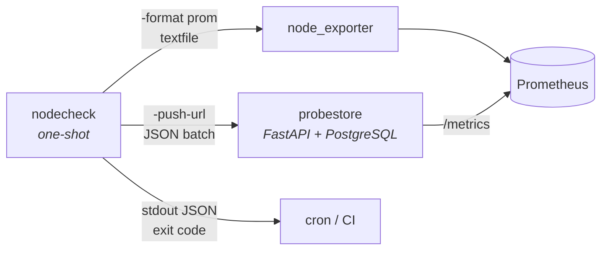

# tunnel-ops

[](https://github.com/mmiasnikou/tunnel-ops/actions)
[](https://github.com/mmiasnikou/tunnel-ops/releases)
[](LICENSE)
[](go.mod)

Operational tooling for running fleets of tunnel exit nodes — WireGuard,
AmneziaWG, VLESS/Reality and friends.

Small Go binaries that answer operational questions about a distributed node
fleet. Static binaries, no runtime.

Dependencies are the standard library plus `golang.org/x/*`, and nothing else.
The exception is not decorative: the WireGuard prober needs BLAKE2s and
ChaCha20-Poly1305, neither of which is in `std` (X25519 is, via `crypto/ecdh`).
Anything outside `std` and `golang.org/x` is a deliberate decision, not a
convenience.

| Component | What it is |
| --------- | ---------- |
| [`nodecheck`](cmd/nodecheck) | Go binary. Concurrent two-phase probes — TLS/Reality (expected SNI), generic UDP, WireGuard (Noise IK initiation). JSON or Prometheus output, static, no runtime. |
| [`probestore`](probestore) | FastAPI + SQLAlchemy 2.0 (async) + Alembic + PostgreSQL. Idempotent ingest of probe runs keyed by `run_id`, history, its own `/metrics`. |



---

## Why two phases

A health check that returns a single boolean tells you almost nothing. A node
whose TCP port is open is not necessarily a node that works.

`nodecheck` deliberately splits the probe:

1. **TCP connect** — is the port open at all?
2. **TLS handshake with the expected SNI** — for VLESS/Reality this is the
   masquerade site the node is supposed to impersonate.

The interesting state is the one in between. **TCP succeeds, TLS fails** means
the port is listening but Reality is misconfigured, the certificate is wrong,
or the traffic is being intercepted. A single boolean would collapse that into
"down" and throw away the diagnosis.

Each phase is timed separately and exported as its own metric. A node whose
handshake latency has quietly doubled is still "up" and is telling you
something a green light never will.

The split generalises past TLS. Every protocol has a reachability phase — did
anything answer at all — and a confirmation phase — was the answer really the
protocol we expect. Which pair of phases a node gets is decided by its `proto`
(see [Probers](#probers)); the reason for having two of them is the same one.

## Install

```bash
git clone https://github.com/mmiasnikou/tunnel-ops
cd tunnel-ops
make build          # binaries land in bin/
make install        # or copy them to /usr/local/bin
```

Prebuilt binaries for linux, windows and darwin (amd64 + arm64) are attached
to each [release](../../releases).

Building by hand:

```bash
CGO_ENABLED=0 go build -ldflags="-s -w" -trimpath -o bin/nodecheck ./cmd/nodecheck
```

`CGO_ENABLED=0` produces a static binary with no libc dependency — it will run
in a `scratch` container.

## Usage

```bash
nodecheck -targets targets.json                    # JSON output
nodecheck -targets targets.json -format prom       # Prometheus text format
nodecheck -targets targets.json -timeout 3s -concurrency 64
nodecheck -version
```

| Flag            | Default                | Meaning                                                        |
| --------------- | ---------------------- | -------------------------------------------------------------- |
| `-targets`      | `targets.json`         | JSON file listing the nodes                                    |
| `-timeout`      | `5s`                   | timeout applied to **each phase** separately                   |
| `-concurrency`  | `32`                   | maximum probes in flight at once                               |
| `-format`       | `json`                 | `json` or `prom`                                               |
| `-push-url`     | —                      | probestore ingest endpoint; when set, the batch is also stored |
| `-push-timeout` | `10s`                  | timeout for the push request                                   |
| `-push-source`  | `nodecheck@<hostname>` | source label recorded with the run                             |
| `-version`      |                        | print version and exit                                         |

**Exit codes:** `0` all nodes healthy, `1` at least one node down (or a bad
targets file), `2` invalid arguments, `3` the push failed. Suitable for cron
and alerting directly. The last one is deliberately distinct: healthy nodes
plus a prober that cannot report is a different alert from a node going dark.

### What a run looks like

A reproducible smoke test against public endpoints — no fleet needed, and you
can run it yourself:

```json
[
  {
    "name": "badsni",
    "addr": "cloudflare.com:443",
    "sni": "wrong-sni.invalid",
    "region": "test",
    "ok": false,
    "tcp_ok": true,
    "tls_ok": false,
    "ts": "2026-08-07T19:01:11.780604814Z",
    "tcp_seconds": 0.146483528,
    "tls_seconds": 0.233876608,
    "cert_match": false,
    "error": "tls: remote error: tls: handshake failure"
  },
  {
    "name": "hole",
    "addr": "192.0.2.1:443",
    "sni": "example.com",
    "region": "test",
    "ok": false,
    "tcp_ok": true,
    "tls_ok": false,
    "ts": "2026-08-07T19:01:16.46606043Z",
    "tcp_seconds": 0.064490465,
    "tls_seconds": 5.001585835,
    "cert_match": false,
    "error": "tls: context deadline exceeded"
  },
  {
    "name": "live",
    "addr": "cloudflare.com:443",
    "sni": "cloudflare.com",
    "region": "test",
    "ok": true,
    "tcp_ok": true,
    "tls_ok": true,
    "ts": "2026-08-07T19:01:11.789463776Z",
    "tcp_seconds": 0.146429082,
    "tls_seconds": 0.242581506,
    "tls_version": "1.3",
    "alpn": "h2",
    "cert_cn": "cloudflare.com",
    "cert_match": true
  }
]
```

Three nodes, three different answers. `badsni` is the one worth looking at:
`tcp_ok` is true and the connect took the same 0.146s as the healthy node — the
port is open, the route is fine, and by any single-boolean check the node
passes. The handshake is what says it is not serving what it is supposed to
serve. `hole` fails differently again, sitting on the phase timeout with an
error that names which phase gave up.

The whole run finishes in `real 5.072s` — bounded by the slowest target rather
than the sum of the three — and exits `1`.

The same run in Prometheus text format:

```
# HELP vpnnode_up Node is reachable (both TCP and TLS succeeded)
# TYPE vpnnode_up gauge
vpnnode_up{node="badsni",region="test"} 0
vpnnode_up{node="hole",region="test"} 0
vpnnode_up{node="live",region="test"} 1
# HELP vpnnode_tcp_connect_seconds Time spent on the TCP connect phase
# TYPE vpnnode_tcp_connect_seconds gauge
vpnnode_tcp_connect_seconds{node="badsni",region="test"} 0.1857
vpnnode_tcp_connect_seconds{node="hole",region="test"} 0.1183
vpnnode_tcp_connect_seconds{node="live",region="test"} 0.1861
# HELP vpnnode_tls_handshake_seconds Time spent on the TLS handshake phase
# TYPE vpnnode_tls_handshake_seconds gauge
vpnnode_tls_handshake_seconds{node="badsni",region="test"} 0.3088
vpnnode_tls_handshake_seconds{node="hole",region="test"} 5.0013
vpnnode_tls_handshake_seconds{node="live",region="test"} 0.3321
# HELP vpnnode_cert_match Presented certificate matches the expected SNI
# TYPE vpnnode_cert_match gauge
vpnnode_cert_match{node="badsni",region="test"} 0
vpnnode_cert_match{node="hole",region="test"} 0
vpnnode_cert_match{node="live",region="test"} 1
# HELP vpnnode_initiation_sent A valid protocol initiation was sent and not contradicted; not a liveness signal
# TYPE vpnnode_initiation_sent gauge
```

`vpnnode_initiation_sent` is declared and carries no samples: this fleet has no
`wireguard` targets. Every family is always declared, so the shape of a scrape
does not change when the composition of the fleet does — a dashboard does not
break because the last WireGuard node was retired.

### Target file

See [`examples/targets.json`](examples/targets.json).

```json
[
  { "name": "de-fra-01", "addr": "203.0.113.10:443", "sni": "www.microsoft.com", "region": "de" }
]
```

`sni` is the masquerade host the node should present. If omitted, the host part
of `addr` is used.

A bad targets file is rejected before any probing starts — an unknown `proto`,
or a `params` object a prober cannot make sense of, fails the whole run with
exit `1`. A typo in the config should not be reported as an outage, and it
must not reach probestore as one either.

What is *not* pre-checked is anything the probe itself reports better: an
address with no port, an unresolvable host. Those come back as ordinary failed
probes, so one bad line does not suppress the results for the rest of the fleet.

## Handling the targets file

`targets.json` is a curated map of a live fleet in a single file. It is more
sensitive than anything the tool outputs: treat it as a secret, keep it out of
version control, and remember that probe output, CI artifacts and logs carry
the same addresses. Every address in this repository is from the documentation
ranges reserved by RFC 5737 and belongs to no node.

Secrets do not belong in the targets file either. The push token and the
WireGuard monitoring key are read from the environment only — a targets file
gets copied between hosts and committed, and a flag is world-readable through
`/proc`.

## Probers

A target picks its check with `proto`. Omitting it means `tls` — every targets
file written before probers existed keeps working untouched.

| `proto`         | Phases             | What it checks                                                           |
| --------------- | ------------------ | ------------------------------------------------------------------------ |
| `tls` (default) | `tcp`, `tls`       | TCP connect, then a TLS handshake with the expected SNI                  |
| `udp`           | `udp`, `response`  | sends a datagram, accepts any reply as proof of life                     |
| `wireguard`     | `udp`, `handshake` | sends a real Noise IK handshake initiation, expects a handshake response |

```json
[
  { "name": "de-fra-01", "addr": "203.0.113.10:443", "sni": "www.microsoft.com", "region": "de" },
  { "name": "de-fra-01-wg", "addr": "203.0.113.10:51820", "region": "de",
    "proto": "wireguard",
    "params": { "public_key": "RVhBTVBMRS1LRVktRE8tTk9ULVVTRS1JTi1QUk9EISE=" } },
  { "name": "nl-ams-01-dns", "addr": "203.0.113.11:53", "region": "nl", "proto": "udp",
    "params": { "payload_hex": "01000000", "attempts": 3 } }
]
```

`udp` params — all optional:

| Field         | Default              | Meaning                                             |
| ------------- | -------------------- | --------------------------------------------------- |
| `payload`     | a single `0x00` byte | bytes to send, as literal text                      |
| `payload_hex` | —                    | the same, hex-encoded, for non-printable payloads   |
| `attempts`    | `3`                  | total datagrams sent before calling the node silent |

The attempts share the phase timeout rather than multiplying it, and exist
because UDP drops packets: one lost datagram is not an outage. A definitive
answer stops the retries early — an ICMP port-unreachable means there is no
listener, and asking again will not change that.

Be honest about what `udp` proves. Its first phase is weak: `net.Dial` on UDP
sends nothing and a write only hands the datagram to the kernel, so that phase
failing is nearly always a local configuration problem. The signal is in the
second phase — something answered, or nothing did. What it cannot tell you is
whether the thing that answered speaks the protocol you expect; that needs a
real handshake, which is what the `wireguard` prober below does, and what the
AmneziaWG prober on the roadmap will add for its obfuscated variant.

### `wireguard`

Builds a genuine WireGuard handshake initiation (Noise IK, message type 1) and
waits for a handshake response (type 2) that carries our own session index
back. Unlike `udp`, this confirms that what is listening really speaks
WireGuard.

```json
{ "name": "de-fra-01-wg", "addr": "203.0.113.10:51820", "region": "de",
  "proto": "wireguard",
  "params": { "public_key": "RVhBTVBMRS1LRVktRE8tTk9ULVVTRS1JTi1QUk9EISE=" } }
```

The key above, and the one in [`examples/targets.json`](examples/targets.json),
is a placeholder — it decodes to the ASCII text
`EXAMPLE-KEY-DO-NOT-USE-IN-PROD!!` and belongs to no node. Replace it with the
output of `wg show wg0 public-key` from the node you are probing.

| Field             | Default | Meaning                                                                                     |
| ----------------- | ------- | ------------------------------------------------------------------------------------------- |
| `public_key`      | —       | the node's static public key, base64 as `wg(8)` prints it. Required                         |
| `attempts`        | `3`     | total initiations sent before calling the node silent                                       |
| `allow_anonymous` | `false` | probe without a registered monitoring peer, at the cost of what the result means. See below |

**A `wireguard` target requires a registered monitoring peer.** WireGuard is
deliberately silent to peers it does not recognise: the node decrypts the
initiator's static key, finds no such peer, and drops the packet without a
word. A probe using an ad-hoc key could therefore never report anything but a
timeout, and a whole fleet would show up as down because of a missing
environment variable. So `nodecheck` refuses such a target when it loads the
file — exit `1`, naming the target — rather than probing it and calling the
node dead.

This is a real operational cost, and it is worth knowing before you adopt the
prober: one keypair has to exist and its public half has to be registered as a
peer on every node in the fleet. One pair covers the whole fleet, and rolling
it out is a single Ansible task or a line in a Terraform template, but it is
not zero.

#### Setting up the monitoring peer

On the monitoring host:

```bash
wg genkey | tee monitor.key | wg pubkey > monitor.pub
chmod 600 monitor.key
export NODECHECK_WG_PRIVATE_KEY=$(cat monitor.key)
```

Keep the key out of any repository working tree.

On every node, register that public key as a peer with an address range of its
own. Check what is already taken first — an `allowed-ips` range that overlaps
an existing peer will break that peer's routing:

```bash
sudo wg show wg0 allowed-ips
sudo wg set wg0 peer "$(cat monitor.pub)" allowed-ips 10.99.0.254/32
```

To keep it across restarts, add to `/etc/wireguard/wg0.conf`:

```ini
[Peer]
PublicKey = <contents of monitor.pub>
AllowedIPs = 10.99.0.254/32
```

The private key is read from the environment only, never from a flag or the
targets file — the same rule as the push token.

#### Reading `wg show` after a probe

`wg show wg0 latest-handshakes` will keep reporting `0` for the monitoring
peer, and that is correct. A responder does not consider a session established
until the initiator sends a transport packet; the probe deliberately sends
none, so it leaves no session behind and no state on the node.

Look at the transfer counters instead:

```
peer: <contents of monitor.pub>
  endpoint: 198.51.100.7:9824
  allowed ips: 10.99.0.254/32
  transfer: 148 B received, 92 B sent
```

Those 92 bytes are the proof. To send them the node had to verify `mac1`,
decrypt the initiator's static key, find the peer, and accept the TAI64N
timestamp — every AEAD tag had to check out.

#### `allow_anonymous`

For a node where registering a monitoring peer is not possible, set
`"allow_anonymous": true`. The initiator's key is then generated fresh per
probe and the second phase is renamed `initiation-sent`, because that is all it
can claim: a well-formed initiation left the host and nothing contradicted it.

**Silence passes in this mode**, so the phase is not evidence that the node is
alive. That is enforced rather than documented: an anonymous target is kept out
of `vpnnode_up` entirely and reported in
[`vpnnode_initiation_sent`](#metrics) instead, so no alert built on
`vpnnode_up` can be fed by it. What the mode still catches is an ICMP
port-unreachable (nothing is listening) and an answer that is not WireGuard.
For real liveness on such a node, use a `udp` target instead.

`mac1` is computed properly — without it a responder discards the packet in
silence. `mac2` and the cookie mechanism are not implemented: a responder under
load answers with a cookie reply (type 3). In the default mode that is reported
as its own named failure rather than as silence, since it still proves a
WireGuard endpoint is there; under `allow_anonymous` it counts as a pass, being
strictly stronger evidence than the silence that already passes.

The prober is not only tested against local fixtures: the initiation it builds
has been accepted by a real WireGuard responder, which answered with a
handshake response over the public internet.

### Output shape

`params` are input configuration and are never echoed back into the output — a
result gets printed, piped into a textfile collector, logged and pasted into
tickets, and prober settings have no diagnostic value on any of those surfaces.

Protocol-specific fields are omitted from the output rather than reported as
zero. A `udp` result carries no `tcp_ok`, `tls_seconds` or `cert_match` keys at
all, because a phase that was never run is a different fact from one that was
run and failed. A TCP+TLS result still reports every one of those fields
exactly as it always did, including as zeroes for a phase the probe never
reached.

## Storing history

A single probe answers *"is the node up right now?"*. Point `-push-url` at a
[probestore](probestore) instance and the answers accumulate instead:

```bash
export NODECHECK_PUSH_TOKEN=...        # never pass the token as a flag: argv is world-readable
nodecheck -targets targets.json -push-url https://probes.example.com/v1/runs
```

Each run carries a generated `run_id`, and probestore keys ingestion on it, so
a push retried after a network failure is stored exactly once. The retry loop
(immediate, then 1s, then 3s) exists because a prober that gives up on the
first refused connection loses precisely the outage it was built to record.
Rejected credentials are not retried — a 401 will be a 401 next time too.

**Only `tls` results are pushed.** The ingest payload's `tcp_ok`/`tls_ok` are
required booleans, so a `udp` result has no honest way to fill them — shipping
one would record `tcp_ok: false, failed_phase: "tcp"` as history for a node
that is perfectly healthy. A gap is better than a stored lie, so those results
are dropped from the batch and only appear on stdout and in `/metrics`.

Carrying them needs both sides changed together: a `proto` field and nullable
phase booleans in the payload, and probestore's `node` uniqueness reconsidered
— it keys on `(addr, sni)`, and UDP targets have no SNI, so two protocols on
one address would collide into a single node. That is a separate, coordinated
change.

probestore's read endpoints are unauthenticated by design, on the assumption of
a reverse proxy in front. Do not expose `/metrics` or `/v1/nodes` publicly:
together they are the whole fleet, addresses included, served over HTTP and
aggregated more conveniently than any scanner could manage on its own.

## Metrics

```
vpnnode_up{node,region}                     1 / 0
vpnnode_tcp_connect_seconds{node,region}
vpnnode_tls_handshake_seconds{node,region}
vpnnode_cert_match{node,region}             1 / 0
vpnnode_initiation_sent{node,region}        1 / 0
```

Labels are deliberately restricted to `node` and `region`, both of bounded
cardinality. Do not add `user_id`, `session_id` or `host:port` — that is the
direct route to a cardinality explosion and a dead metrics store. `proto` is
not a label either: it would be bounded, but adding it changes the identity of
every existing series and breaks the dashboards and recording rules already
built on them. Node names and regions go out; addresses stay in the targets
file.

`vpnnode_up` carries every result that is a statement about node liveness — and
only those. A probe that cannot make that statement is published in
`vpnnode_initiation_sent` instead and never appears in `vpnnode_up` at all;
today that is exactly the `wireguard` targets with `allow_anonymous: true`,
where silence is the designed answer from a healthy node and from an absent one
alike. `vpnnode_initiation_sent` is `1` when a valid initiation went out and
nothing contradicted it, `0` when something did (ICMP port-unreachable, or an
answer that is not WireGuard). Alert on `vpnnode_up`; treat
`vpnnode_initiation_sent` as "the packet left and nothing said otherwise".

One consequence worth planning for: switching an existing target to
`allow_anonymous` makes its `vpnnode_up` series stop, which to Prometheus looks
like a target that went away. An alert built on `absent()` will fire.

The phase metrics carry a sample only for the nodes that actually ran that
phase, so a `udp` node appears in `vpnnode_up` and nowhere else — publishing
`0.0000` for a handshake it never performed would feed an invented number to
anything computing an average. The metric families are always declared, so the
shape of a scrape does not change with the composition of the fleet.

### Collecting

**Textfile collector** (simplest — reuse an existing `node_exporter`):

```bash
*/2 * * * * nodecheck -targets /etc/tunnel-ops/targets.json -format prom \
  > /var/lib/node_exporter/textfile/nodecheck.prom.$$ \
  && mv /var/lib/node_exporter/textfile/nodecheck.prom.$$ \
        /var/lib/node_exporter/textfile/nodecheck.prom
```

Writing to a temporary file and renaming it is not decoration: `mv` within a
filesystem is atomic, so the collector never reads a half-written file.

**systemd timer** — a `oneshot` `.service` plus a `.timer` with
`OnCalendar=*:0/2`, if you prefer timers to cron.

## Limitations

`cert_match` compares the presented certificate against the SNI that was
requested. It verifies the chain against the system trust store, but it cannot
distinguish an honest node from one behind an intercepting middlebox whose CA
is already trusted by the host running the probe. For a fleet whose whole
purpose is resisting interception, that gap matters. Pinning an expected
certificate fingerprint per target closes it — see the roadmap.

The `wireguard` prober needs a monitoring peer registered on every node, as
described above. Where that is not possible, `allow_anonymous` is available but
proves considerably less.

The WireGuard handshake response is currently accepted on its message type and
session index; its contents are not decrypted. That is enough to prove a
WireGuard endpoint answered our specific initiation, but not that it holds the
private key matching the configured `public_key` — see the roadmap.

## Roadmap

- Certificate fingerprint pinning per target, to detect interception
- `/metrics` HTTP endpoint for pull-based scraping instead of one-shot runs
- AmneziaWG prober: the same handshake under its obfuscation parameters
  (`jc`, `jmin`, `jmax`, `s1`, `s2`, `h1`–`h4`)
- `mac2` and cookie retry for the WireGuard prober, so a responder under load
  can be probed rather than just recognised
- Cryptographic verification of the WireGuard handshake response, which would
  prove the responder holds the configured private key rather than only that
  it answered our session
- Push non-`tls` results to probestore (needs the coordinated ingest change
  described under [Storing history](#storing-history))
- Probes originating from inside filtered networks — the metric that actually
  matters, since a node can be perfectly alive from the outside and unreachable
  from where the users are
- Per-ASN IP survival history: which hosting providers keep addresses longest

## Development

```bash
make help     # list targets
make          # fmt, vet, test, build
make race     # tests under the race detector
make cover    # coverage report
make dist     # cross-compile everything + SHA256SUMS
```

CI runs `gofmt`, `go vet`, `go test -race` with coverage, and verifies cross
compilation for all five platforms on every push and pull request. Pushing a
`v*` tag builds every binary for every platform and attaches them with
`SHA256SUMS` to a GitHub release.

Adding a tool means creating `cmd/<name>/`. The Makefile and both workflows
discover it automatically; neither needs editing.

## License

MIT — see [LICENSE](LICENSE).
